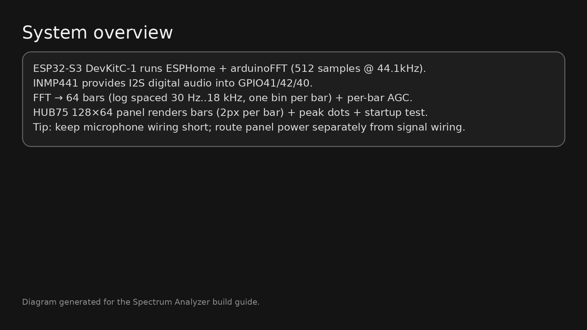
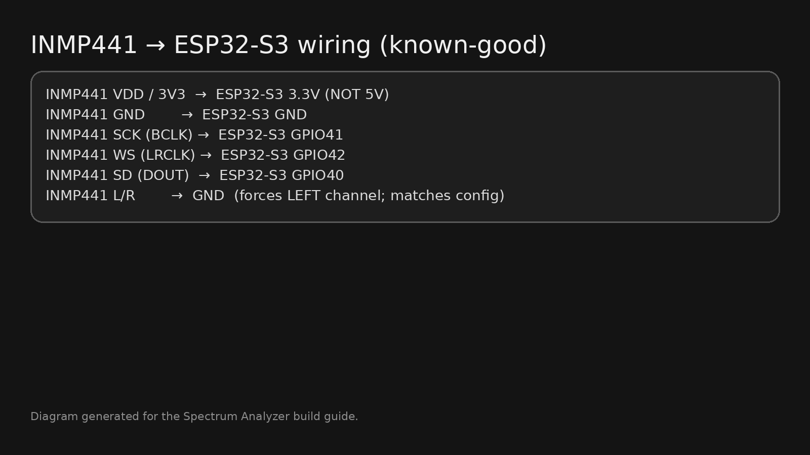
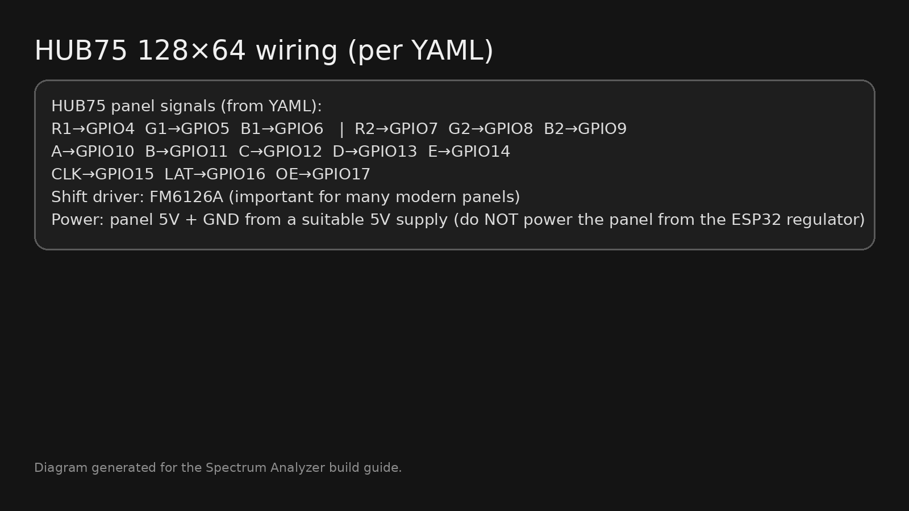

# Spectrum Analyzer (ESP32-S3 + HUB75 + INMP441)

A fast, colorful **64‑band audio spectrum analyzer** for a **HUB75 128×64 RGB matrix**, built on **ESP32‑S3 + ESPHome** with an **INMP441 I2S microphone**.

> ✅ **Important:** This repository intentionally **does not include any Wi‑Fi passwords, API keys, or OTA passwords**.  
> The ESPHome YAML uses `!secret` placeholders. You must create your own `secrets.yaml` (see **Quick Start**).

---

## Demo / Gallery

| Running | Build (front) |
|---|---|
|  |  |

| Panel back / power | Controller close‑up |
|---|---|
|  |  |

More diagrams:
- 
- 
- 

---

## Features

- **64 independent bars** (no grouping) across **30 Hz → 18 kHz**, log-spaced, **one FFT bin per bar**
- **Per‑bar slow AGC (~4 minutes)** for long-term balance, with AGC tie‑limits between channels
- **Noise floor tracking + gating** to reduce “always-on” LEDs in silence
- **Short-term dynamics (≈20s range)** so music feels lively and responsive
- **Peak dots** with a slower decay for readable transients
- **Color gradient** left→right (low→high): Red→Orange→Yellow→Green→Cyan→Blue  
  …with an optional **purple shift near the top** of tall bars (visual “hot” indicator)
- **Startup animation** (full-screen test) + a tiny **status pixel** (API connected vs waiting)
- Tuned for **ESP32‑S3 DevKitC‑1 + HUB75 128×64 + FM6126A panels + INMP441**

---

## Quick Start (ESPHome)

### 1) Copy files into your ESPHome config folder

Copy everything from `esphome/` into your Home Assistant ESPHome directory, e.g.:

- `esphome/spectrum-analyzer.yaml`
- `esphome/spectrum_includes.h`
- `esphome/secrets.example.yaml`

### 2) Create your `secrets.yaml` (required)

1. Copy `esphome/secrets.example.yaml` → `esphome/secrets.yaml`
2. Fill in your own values:

```yaml
wifi_ssid: "YOUR_WIFI_SSID"
wifi_password: "YOUR_WIFI_PASSWORD"
api_encryption_key: "YOUR_API_KEY"
ota_password: "YOUR_OTA_PASSWORD"
ap_password: "YOUR_FALLBACK_AP_PASSWORD"
```

> **Why?** I removed all credentials (Wi‑Fi, API encryption, OTA, fallback AP password) so this repo is safe to publish.

### 3) Add the device in ESPHome and install

- In Home Assistant → **ESPHome** → **NEW DEVICE** (or add an existing YAML)
- Paste/point it at `spectrum-analyzer.yaml`
- Click **Install** → choose your preferred method (USB / OTA)

**Build & wiring details are in:**  
- `docs/BUILD.md` (step-by-step build tutorial)  
- `docs/WIRING.md` (exact known-good pin mapping)

---

## Hardware (known-good)

This build is based on the hardware that was used during development:

- **ESP32‑S3 DevKitC‑1**
- **HUB75 RGB Matrix Panel: 128×64** (FM6126A shift driver used in config)
- **INMP441 I2S microphone module**
- **5V power supply** sized for your panel (current depends heavily on brightness/content)

### Product links used for this build (your provided links)

- https://www.aliexpress.com/item/1005010227131923.html  
- https://www.aliexpress.com/item/1005007319706057.html  
- https://www.aliexpress.com/item/1005006155582430.html  

> If you want the repo to embed the exact product photos from those listings, add them under `images/parts/`
> and open a PR (or send me the images and I’ll add them).

---

## How it works (high level)

1. **Audio**: INMP441 streams I2S audio into the ESP32‑S3.
2. **FFT**: 512 samples @ 44.1kHz → magnitude spectrum.
3. **Frequency map**: 64 bars → log-spaced 30 Hz..18 kHz → **one bin per bar**.
4. **Per‑bar processing**:
   - noise floor tracking (fast down / slow up)
   - gated SNR
   - short-term (≈20s) max tracking for dynamic range
   - 10-minute bucketed maxima to prevent “too sensitive after loud music”
   - slow AGC (~4 min) to keep channels balanced long-term
5. **Rendering**:
   - each bar is 2px wide on a 128px panel; a 1px gap is used outside boot animation
   - bottom fade reduces “always-on” look and lowers LED count near the floor
   - peak dot provides transient visibility

For deep tuning notes, see `docs/TUNING.md`.

---

## Donate

If this project saved you time (or you just like blinking lights), you can buy me a coffee:

**PayPal:** https://www.paypal.com/ncp/payment/4TJHCC8A2GCJQ

---

## Make this repo popular (what helps)

- ⭐ Star the repo
- 📸 Add your build photos to the Gallery (PRs welcome!)
- 🧵 Share it on Reddit / Discord / Home Assistant forums with a short clip
- 🏷️ Add GitHub topics: `esphome`, `esp32`, `hub75`, `rgb-matrix`, `fft`, `audio`, `spectrum-analyzer`

---

## Contributing

See `CONTRIBUTING.md`. Bug reports should include:
- Your panel model (and whether it needs FM6126A)
- ESP32 board + framework
- A photo of wiring (especially HUB75 + power)
- ESPHome logs (DEBUG)

---

## License

MIT — see `LICENSE`.
