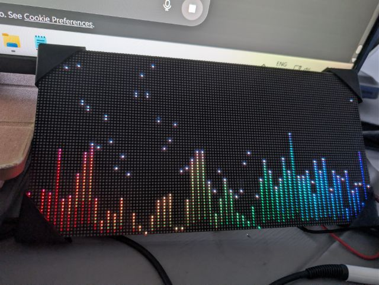
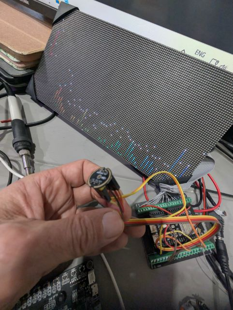
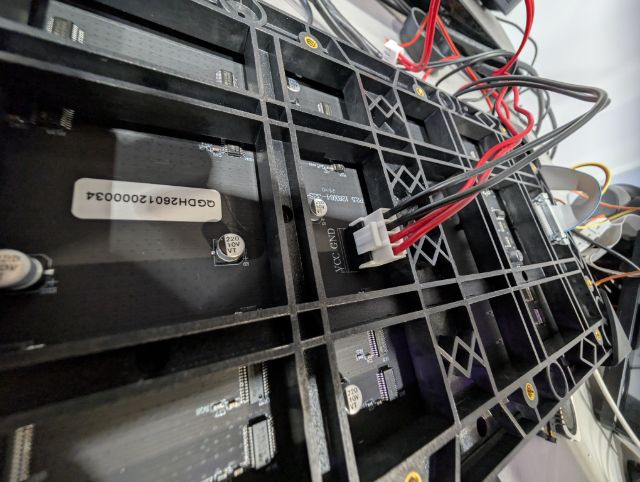
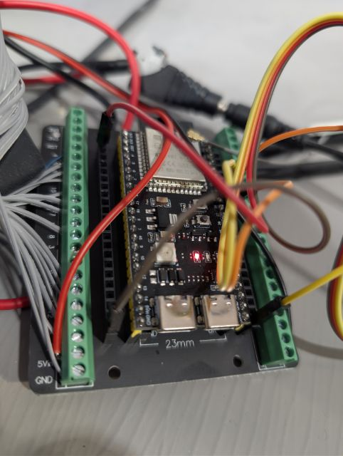

# Spectrum Plus

> **Status: Alpha** — firmware is written but not yet validated on hardware.

A fast, colorful **128-band audio spectrum analyzer** for two daisy-chained
**HUB75 128×64 RGB LED matrix panels** (256×64 total), powered by the
**Waveshare ESP32-P4 Module Dev Kit** with its **onboard MEMS microphone**.

Pure C++ firmware on ESP-IDF — no Home Assistant, no Wi-Fi, no cloud.
Power it on and it runs.

> **Note:** The photos below are from the original
> [Spectrum](https://github.com/gbroeckling/Spectrum) project (single panel,
> ESP32-S3, 64 bars). Spectrum Plus hardware photos coming soon.

---

## Demo / Gallery

| Running (original Spectrum) | Build front (original) |
|---|---|
|  |  |

| Panel back / power (original) | Controller close-up (original) |
|---|---|
|  |  |

*Built a Spectrum Plus? PR your photos to the gallery!*

---

## What changed from Spectrum → Spectrum Plus

| | Spectrum | Spectrum Plus |
|---|---|---|
| Board | ESP32-S3 DevKitC-1 | Waveshare ESP32-P4 (SKU:30560) |
| CPU | Xtensa dual-core 240 MHz | RISC-V dual-core 400 MHz |
| Microphone | External INMP441 module | Onboard MEMS mic + ES8311 codec |
| Display | 1× 128×64 HUB75 panel | 2× 128×64 HUB75 panels (256×64) |
| Frequency bars | 64 | 128 |
| FFT | 512-point (arduinoFFT) | 1024-point (esp-dsp) |
| Framework | ESPHome (Arduino) | Pure ESP-IDF (CMake) |
| Home Assistant | Yes (API + OTA + Wi-Fi) | No — standalone firmware |

---

## Features

- **128 frequency bars** from 30 Hz to 18 kHz (log-spaced, one FFT bin per bar)
- **1024-point FFT** at 44.1 kHz for high frequency resolution
- **Per-bar DSP pipeline:**
  - Adaptive noise floor tracking (fast down / slow up)
  - SNR gating to keep silent bars dark
  - Slow AGC (~4 min) per bar for long-term balance
  - Short-term max tracking (~20 s) for visual dynamics
  - 10-minute bucketed maxima to prevent over-sensitivity after loud peaks
  - AGC tie: max/min gain ratio capped at 2.5×
- **Color gradient:** Red → Orange → Yellow → Green → Cyan → Blue
- **Purple heat shift** near the top of tall bars
- **Bottom fade** that reduces "always-on" LEDs during quiet passages
- **White peak dots** with slow decay
- **6-second boot animation** (sine-wave pattern across all 128 bars)
- **Status pixel** (red = booting, green = running)
- **Dual-core FreeRTOS:** FFT sampling on core 0, display rendering on core 1

---

## Hardware

- **Waveshare ESP32-P4 Module Dev Kit** (SKU:30560)
- **2× HUB75 RGB matrix panels**, 128×64 each, FM6126A shift driver
- **1× HUB75 16-pin ribbon cable** (panel 1 OUT → panel 2 IN)
- **5 V power supply** rated for both panels (~4 A per panel)

The microphone is built into the dev kit — no external mic module needed.

See [hardware/BOM.md](hardware/BOM.md) for the full parts list and
[docs/WIRING.md](docs/WIRING.md) for the complete pin map.

---

## Quick start

### 1. Install ESP-IDF

Follow [Espressif's official guide](https://docs.espressif.com/projects/esp-idf/en/stable/esp32p4/get-started/index.html)
to install ESP-IDF v5.3+ with ESP32-P4 support.

### 2. Clone and build

```bash
git clone https://github.com/gbroeckling/spectrum-plus.git
cd spectrum-plus/firmware
idf.py set-target esp32p4
idf.py build
```

### 3. Flash

Connect the dev kit via USB-C, then:

```bash
idf.py -p /dev/ttyUSB0 flash monitor
```

(Replace `/dev/ttyUSB0` with your serial port — `COMx` on Windows.)

### 4. Wire the panels

Connect the HUB75 panels to the GPIOs listed in
[docs/WIRING.md](docs/WIRING.md). Daisy-chain the second panel from the
first panel's output connector. Power both panels from a 5 V supply with
a common ground to the dev kit.

### 5. Power on

The boot animation runs for 6 seconds, then the spectrum analyzer starts.
No network, no app, no config — just audio and light.

---

## Project structure

```
spectrum-plus/
├── firmware/                   ESP-IDF project
│   ├── CMakeLists.txt
│   ├── sdkconfig.defaults      ESP32-P4 build defaults
│   ├── partitions.csv
│   └── main/
│       ├── main.cpp            Entry point, display, FreeRTOS tasks
│       ├── spectrum_dsp.h      FFT + full DSP pipeline (128 bars)
│       ├── i2s_mic.h           Onboard mic via ES8311 codec
│       ├── pin_config.h        All GPIO assignments (edit here)
│       ├── idf_component.yml   esp-dsp + HUB75 DMA dependencies
│       └── CMakeLists.txt
├── hardware/
│   └── BOM.md                  Bill of materials
├── docs/
│   ├── BUILD.md                Build & flash guide
│   ├── WIRING.md               Pin map & daisy-chain instructions
│   ├── TUNING.md               DSP parameter reference
│   └── FAQ.md                  Troubleshooting
├── images/                     Photos (from original Spectrum build)
├── CHANGELOG.md
├── VERSION.txt
├── LICENSE                     MIT
├── SECURITY.md
├── CONTRIBUTING.md
└── CODE_OF_CONDUCT.md
```

---

## Tuning

All DSP constants live in `firmware/main/spectrum_dsp.h`.
See [docs/TUNING.md](docs/TUNING.md) for a parameter-by-parameter guide.

---

## How it works

1. **Audio:** Onboard MEMS mic → ES8311 codec → I2S → ESP32-P4
2. **FFT:** 1024 samples @ 44.1 kHz → magnitude spectrum
3. **Frequency map:** 128 bars, log-spaced 30 Hz–18 kHz, one bin per bar
4. **Per-bar processing:**
   - Noise floor tracking (fast down / slow up)
   - Gated SNR
   - Short-term (~20 s) max tracking for dynamic range
   - 10-minute bucketed maxima to prevent hyper-sensitivity
   - Slow AGC (~4 min) to keep channels balanced long-term
5. **Rendering:**
   - Each bar is 2 px wide on a 256 px display, with a 1 px gap
   - Bottom fade reduces "always-on" look near the floor
   - Peak dots provide transient visibility
   - Color gradient with purple heat shift at bar tops

---

## Donate

If this project saved you time (or you just like blinking lights):

**PayPal:** https://www.paypal.com/ncp/payment/4TJHCC8A2GCJQ

---

## Development

Built by **Garry Broeckling**. Implementation is AI-assisted using
**Claude** by Anthropic — all architecture, product decisions, testing,
and releases are human-directed.

Based on the original [Spectrum](https://github.com/gbroeckling/Spectrum)
project (ESP32-S3 / ESPHome / 64-bar).

---

## Contributing

See [CONTRIBUTING.md](CONTRIBUTING.md). Bug reports should include:
- ESP-IDF version
- HUB75 panel model / shift driver
- Serial monitor logs
- Photos of wiring (especially HUB75 + power)

---

## License

MIT — see [LICENSE](LICENSE).

Copyright (c) 2026 Garry Broeckling.
